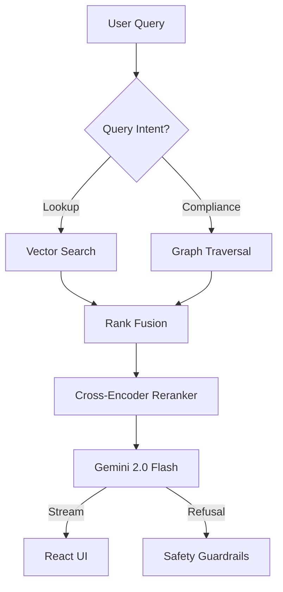

# 🇪🇺 EU AI Act & GDPR Compliance Assistant (Graph RAG)

> **Repository Name Suggestion**: `eu-ai-gdpr-rag`

An advanced **Graph Retrieval Augmented Generation (GraphRAG)** system that synthesizes precise legal answers from the **EU AI Act** and **GDPR**.

It goes beyond vector search by using a **Smart Graph Retrieval** engine to "walk" the complex web of cross-references (e.g., "Article 5 cites Article 13"), ensuring high-precision legal citations and detecting conflicts between regulations.


---

## �️ Architecture

The system uses a **Hybrid Graph-Vector** architecture to capture both semantic meaning and strict legal hierarchy.



---

## 🌟 Key Features

### 🧠 Smart Graph Retrieval
Legal documents are highly interconnected. A simple vector search misses context.
- **Recursive Traversal**: If Article 35 mentions Article 6, the system fetches Article 6 automatically.
- **Parent-Child Chunking**: Retains full article context while retrieving specific paragraphs.

### 🛡️ Confidence & Safety Gates
The system knows when it doesn't know.
- **Calibrated Confidence**: Returns a 0-100% score with every answer.
- **Refusal Mechanism**: Automatically declines to answer if confidence is < 60% (prevents hallucinations).
- **Conflict Detection**: Identifies "Lex Specialis" rules where the EU AI Act overrides GDPR.

### ⚡ Production-Ready Engineering
- **Streaming Responses**: Real-time token streaming using Server-Sent Events (SSE).
- **Port Management**: Custom PowerShell script automatically cleans ports 8000/3000 before startup.
- **React Flow Visualization**: Interactive graph view of retrieved citations.

---

## 📊 Evaluation Metrics

We benchmarked three implementation phases using **RAGAS** (Retrieval Augmented Generation Assessment) on a 30-question "Golden Dataset".

| Implementation Phase | Correctness (1-5) | Context Recall | Improvement Notes |
| :--- | :--- | :--- | :--- |
| **Phase 1: Baseline** | 2.90 | 82.0% | Standard chunking, frequent hallucinations. |
| **Phase 2: Parent-Child** | 3.23 | 91.0% | Added hierarchical context. Better precision. |
| **Phase 3: Graph RAG** | **3.30** 🏆 | **97.5%** | **Best Performance**. Graph traversal captured hidden citations. |

> **Key Result**: The Graph RAG approach improved Context Recall by **15.5%** over the baseline.

---

## 🚀 Getting Started

### Prerequisites
*   Python 3.10+
*   Node.js 18+
*   Google Gemini API Key

### Quick Start (Windows)

We provide a robust startup script that handles environment checks and port cleanup:

```powershell
# Starts Backend (FastAPI) and Frontend (Next.js) in separate windows
.\start-servers.ps1
```

### Manual Installation

#### 1. Backend (FastAPI)
```bash
# Install dependencies using uv (fast pip alternative)
uv sync

# Setup Environment
echo "GEMINI_API_KEY=your_key_here" > .env

# Build the Knowledge Graph
uv run python scripts/ingest_advanced.py
uv run python src/data/graph_builder.py

# Run Server
uv run python -m src.serving.api
```

#### 2. Frontend (Next.js)
```bash
cd ui
npm install
npm run dev
```

---

## 📂 Project Structure

```
eu-ai-gdpr-rag/
├── data/               # Vector Store & Knowledge Graph artifacts
├── scripts/            # Ingestion & Graph Building scripts
├── src/
│   ├── data/           # Chunking & Embedding logic
│   ├── retrieval/      # NetworkX Graph Walker & Hybrid Search
│   ├── generation/     # LLM Prompts & RAG Generator
│   ├── evaluation/     # RAGAS Evaluation pipeline
│   └── serving/        # FastAPI Endpoints
├── ui/                 # Next.js 15 + Tailwind + Shadcn/UI
├── start-servers.ps1   # Robust startup automation
└── README.md           # You are here
```

## 📜 License
MIT License - feel free to use this for your own legal RAG projects.
